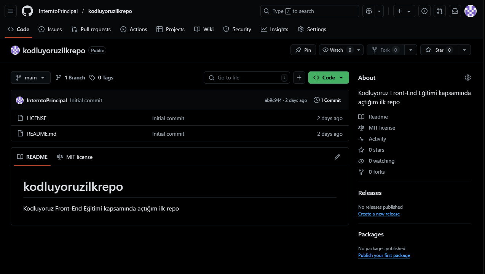

 # Kodluyouz ilk Repo
 Bu repo [Kodluyoruz](https://www.kodluyoruz.org/) Front-End Eğitiminde oluşturduğumuz ilk repo. İçerisinde bir adet README dosyası,bir adet index.html dosyası, bir adet de png dosyası barındırıyor.

 

 ## Installation
 Öncelikle projeyi clonelayın. (Buraya sizin reponuzdan aldığınız bir link gelecek)
 ```bash
 git clone https://github.com/InterntoPrincipal/kodluyoruzilkrepo
 ```
 ## Usage

Projeyi cloneladıktan sonra Visual Studio Code programında açınız.

Linux için:
```linux
cd kodluyoruzilkrepo
code .
```

## Contributing
Pull requestler kabul edilir. Büyük değişiklikler için, lütfen önce neyi değiştirmek istediğinizi tartışmak için bir konu açınız.


## License
[MIT](https://choosealicense.com/licenses/mit/)